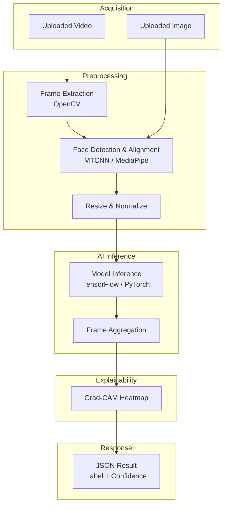

# AI Processing Pipeline

## Pipeline Diagram



## Step-by-Step Pipeline

### Step 1: Input Ingestion
- Accept `.mp4/.avi/.mov` (video) or `.jpg/.png` (image)
- Validate file integrity and size

### Step 2: Frame Extraction (video only)
```python
import cv2

def extract_frames(video_path, fps=5):
    cap = cv2.VideoCapture(video_path)
    frames = []
    frame_rate = cap.get(cv2.CAP_PROP_FPS)
    interval = int(frame_rate // fps)
    count = 0
    while cap.isOpened():
        ret, frame = cap.read()
        if not ret:
            break
        if count % interval == 0:
            frames.append(frame)
        count += 1
    cap.release()
    return frames
```

### Step 3: Face Detection & Alignment
```python
from mtcnn import MTCNN

detector = MTCNN()

def extract_face(frame, size=(299, 299)):
    result = detector.detect_faces(frame)
    if not result:
        return None
    x, y, w, h = result[0]['box']
    face = frame[y:y+h, x:x+w]
    face = cv2.resize(face, size)
    return face
```

### Step 4: Preprocessing & Normalization
```python
import numpy as np

def preprocess(face_img):
    face_img = face_img.astype('float32') / 255.0
    face_img = np.expand_dims(face_img, axis=0)
    return face_img
```

### Step 5: Model Inference (TensorFlow example)
```python
import tensorflow as tf

model = tf.keras.models.load_model('models/xception_deepfake.h5')

def predict(face_img):
    pred = model.predict(face_img)[0][0]
    label = 'FAKE' if pred > 0.5 else 'REAL'
    confidence = pred if pred > 0.5 else 1 - pred
    return label, float(confidence)
```

### Step 5 (Alt): Model Inference (PyTorch example)
```python
import torch

model = torch.load('models/efficientnet_deepfake.pt')
model.eval()

def predict_torch(face_tensor):
    with torch.no_grad():
        output = model(face_tensor)
        prob = torch.sigmoid(output).item()
        label = 'FAKE' if prob > 0.5 else 'REAL'
        return label, prob
```

### Step 6: Frame Aggregation (video)
- Average or majority-vote across all sampled frame predictions
- Weight frames by face-detection confidence

### Step 7: Explainability (Grad-CAM)
- Generate heatmap highlighting manipulated facial regions (eyes, mouth, blending boundaries)

### Step 8: Response Formatting
```json
{
  "result": "FAKE",
  "confidence": 0.94,
  "frames_analyzed": 25,
  "fake_frame_ratio": 0.88,
  "heatmap_url": "/static/heatmaps/xyz.png"
}
```

## Pipeline Summary Diagram

```
Input → Frame Extraction → Face Detection → Preprocessing 
→ Model Inference (TF/PyTorch) → Aggregation → Grad-CAM → JSON Response
```
