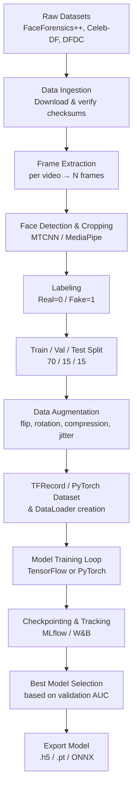
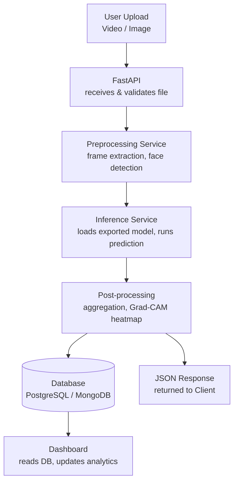

# Complete Data Flow

## 1. Training-Time Data Flow

## 2. Inference-Time Data Flow

## 3. Data Versioning

- Use **DVC (Data Version Control)** to track dataset versions and preprocessing pipeline outputs alongside Git.
- Tag each trained model with the dataset version + hyperparameters used, stored in `configs/model_registry.yaml`.

## 4. Data Governance Notes

- No personally identifiable raw footage should be stored beyond what's needed for evaluation.
- All datasets must be used respecting their original licenses (e.g., FaceForensics++ requires signed agreement).
