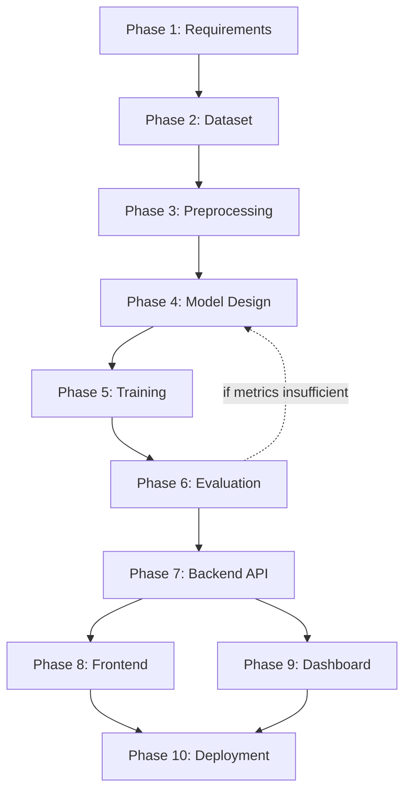

# Complete Development Roadmap

## Timeline Overview (Suggested — adjust to your team size/pace)

| Week(s) | Phase | Focus |
|---|---|---|
| 1 | Phase 1 | Requirement analysis, literature review, framework decision |
| 2 | Phase 2 | Dataset acquisition, licensing, metadata setup |
| 3–4 | Phase 3 | Preprocessing pipeline (face detection, alignment, augmentation) |
| 5 | Phase 4 | Model architecture design & selection |
| 6–8 | Phase 5 | Model training (baseline → fine-tuning → hyperparameter search) |
| 9 | Phase 6 | Evaluation, cross-dataset testing, robustness checks |
| 10–11 | Phase 7 | Backend API development (FastAPI) |
| 12 | Phase 8 | Frontend/UI development |
| 13 | Phase 9 | Dashboard & monitoring setup |
| 14 | Phase 10 | Deployment (Docker/Cloud, optional edge/Raspberry Pi) |
| 15 | — | Integration testing, bug fixing, documentation, launch |

## Dependency Graph

## Milestones & Exit Criteria

| Milestone | Exit Criteria |
|---|---|
| M1: Data Ready | Metadata CSV complete, train/val/test split fixed |
| M2: Baseline Model | Trained model achieves >80% val accuracy |
| M3: Production Model | Model achieves target AUC (>0.90) on held-out + cross-dataset test |
| M4: API Live | FastAPI serving predictions with <5s latency |
| M5: Full Stack Demo | Frontend + API + Dashboard integrated end-to-end |
| M6: Deployed | Dockerized system running on cloud (and optionally edge device) |

## Risk Management
- **Dataset access delays** (FaceForensics++ requires agreement signing) → start Phase 1/2 in parallel, have Celeb-DF as backup.
- **Poor generalization to new deepfake methods** → mitigate with cross-dataset validation and periodic retraining pipeline.
- **Compute limits** → use Google Colab Pro/Kaggle free GPUs initially, or cloud GPU spot instances for training.
