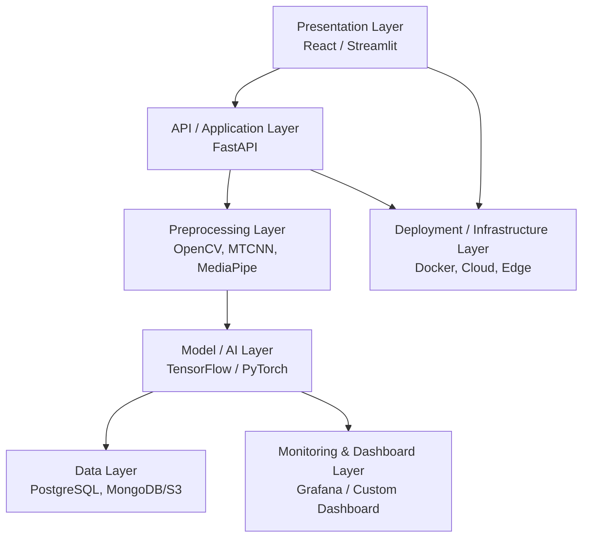

# Layered System Architecture

## Layer Diagram

## 1. Presentation Layer
- **Tech:** React.js / Streamlit
- **Responsibility:** File upload UI, result display, confidence visualization, heatmap overlay.
- **Key Screens:** Upload page, Result page, History dashboard.

## 2. API / Application Layer
- **Tech:** FastAPI (Python), Pydantic for schema validation
- **Responsibility:**
  - Receive uploaded file
  - Validate format (mp4, jpg, png, etc.) and size
  - Route to preprocessing → inference pipeline
  - Return structured JSON response
- **Endpoints (planned):**
  - `POST /api/v1/detect/image`
  - `POST /api/v1/detect/video`
  - `GET /api/v1/history/{user_id}`
  - `GET /api/v1/health`

## 3. Preprocessing Layer
- **Tech:** OpenCV, MTCNN, MediaPipe, dlib, FFmpeg
- **Responsibility:**
  - Extract frames from video at fixed FPS
  - Detect and crop face regions
  - Align faces (eye/nose landmark alignment)
  - Resize to model input size (e.g., 224x224 / 299x299)
  - Normalize pixel values

## 4. Model / AI Layer
- **Tech:** TensorFlow 2.x / PyTorch
- **Responsibility:**
  - Load trained CNN-based model (XceptionNet / EfficientNet / ResNet / ViT)
  - Run batch inference on extracted face frames
  - Aggregate frame-level predictions into a single video-level score
  - Optionally run Grad-CAM for explainability

## 5. Data Layer
- **Tech:** PostgreSQL (structured metadata), MongoDB or S3/MinIO (media/blob storage)
- **Responsibility:**
  - Store uploaded media references
  - Store prediction results, timestamps, confidence scores
  - Store training datasets/version metadata

## 6. Monitoring & Dashboard Layer
- **Tech:** Grafana / custom React dashboard, Prometheus (optional)
- **Responsibility:**
  - Track number of detections, fake vs real ratio
  - Model performance drift monitoring
  - System health metrics (latency, error rate)

## 7. Deployment / Infrastructure Layer
- **Tech:** Docker, Docker Compose, Nginx, Cloud (AWS/GCP/Azure) or Edge (Raspberry Pi/Jetson Nano)
- **Responsibility:**
  - Containerize each service
  - CI/CD pipeline (GitHub Actions)
  - Load balancing and horizontal scaling

## Layer Interaction Rule

Each layer communicates only with its adjacent layer (strict separation of concerns), enabling independent scaling, testing, and replacement (e.g., swapping TensorFlow model for PyTorch model without touching the API layer).
