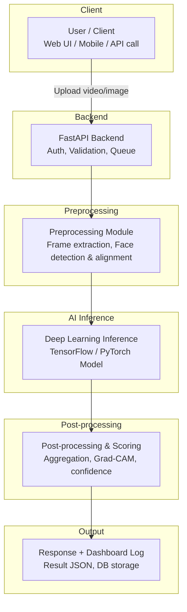

# Overall System Architecture

## High-Level Diagram

## Core Components

1. **Client Layer** — Web/mobile interface where users upload media.
2. **API Gateway (FastAPI)** — Handles requests, authentication, rate limiting.
3. **Preprocessing Engine** — OpenCV + MTCNN/MediaPipe for face detection, frame sampling.
4. **Model Inference Engine** — Loads trained TensorFlow/PyTorch model (ONNX optional for speed).
5. **Explainability Module** — Grad-CAM/heatmaps to show which facial regions triggered detection.
6. **Database Layer** — Stores requests, results, logs (PostgreSQL/MongoDB).
7. **Dashboard** — Visualizes detection statistics and trends.
8. **Deployment Layer** — Docker containers, optional cloud/edge deployment.

## Data Flow Summary

Video/Image → Frame Extraction → Face Detection → Preprocessing (resize, normalize) → Model Inference → Aggregation across frames → Final Real/Fake Classification + Confidence Score → Stored & Displayed.

## Non-Functional Requirements

- **Latency:** Inference under 3–5 seconds per short video clip.
- **Scalability:** Support batch processing and concurrent requests via async FastAPI + task queue (Celery/Redis).
- **Accuracy target:** >90% on benchmark datasets (FaceForensics++, Celeb-DF).
- **Security:** Input validation, file size/type limits, rate limiting.
